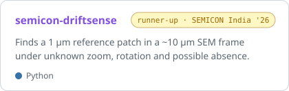
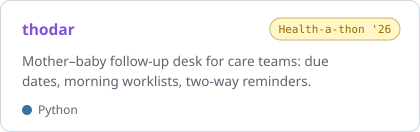
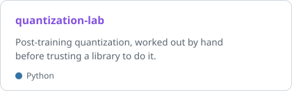
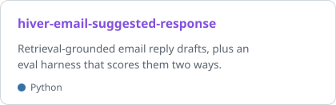
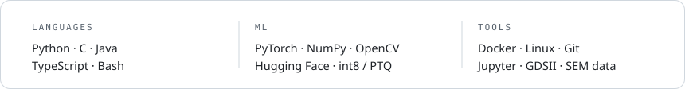

<picture><source media="(prefers-color-scheme: dark)" srcset="assets/header-dark.0a5fdc90.svg"></picture>

ECE student who kept ending up in the inference code. Right now I'm building **neka-rt**, a local-first inference runtime (private for now), and calibrating int8 models in [quantization-lab](https://github.com/vhmaadhav/quantization-lab).

### Selected work

<a href="https://github.com/vhmaadhav/semicon-driftsense"><picture><source media="(prefers-color-scheme: dark)" srcset="assets/card-semicon-driftsense-dark.8a21cac6.svg"></picture></a> <a href="https://github.com/vhmaadhav/razorpay-agentic-firewall"><picture><source media="(prefers-color-scheme: dark)" srcset="assets/card-razorpay-agentic-firewall-dark.3d9e6823.svg"></picture></a>
<a href="https://github.com/vhmaadhav/thodar"><picture><source media="(prefers-color-scheme: dark)" srcset="assets/card-thodar-dark.13cef3fa.svg"></picture></a> <a href="https://github.com/vhmaadhav/quantization-lab"><picture><source media="(prefers-color-scheme: dark)" srcset="assets/card-quantization-lab-dark.75643d84.svg"></picture></a>
<a href="https://github.com/vhmaadhav/hiver-email-suggested-response"><picture><source media="(prefers-color-scheme: dark)" srcset="assets/card-hiver-email-suggested-response-dark.5bcd5baf.svg"></picture></a> <a href="https://github.com/vhmaadhav/karpathy-zero-to-hero"><picture><source media="(prefers-color-scheme: dark)" srcset="assets/card-karpathy-zero-to-hero-dark.e2a61b14.svg"></picture></a>

### Stack

<picture><source media="(prefers-color-scheme: dark)" srcset="assets/stack-dark.92db1278.svg"></picture>

<a href="mailto:sid.maadhav@gmail.com">email</a> &nbsp;·&nbsp; <a href="https://www.linkedin.com/in/vhmaadhav">linkedin</a> &nbsp;·&nbsp; <a href="https://x.com/maadh3v">x</a> &nbsp;·&nbsp; <a href="https://orcid.org/0009-0002-9269-7337">orcid</a>
