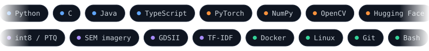

  

  

  
  

  
  

<a href="https://github.com/vhmaadhav/semicon-driftsense">semicon-driftsense</a> &nbsp;·&nbsp; <a href="https://github.com/vhmaadhav/quantization-lab">quantization-lab</a> &nbsp;·&nbsp; <a href="https://github.com/vhmaadhav/hiver-email-suggested-response">hiver-email-suggested-response</a> &nbsp;·&nbsp; <a href="https://github.com/vhmaadhav/SarvamBatchTranscriber">SarvamBatchTranscriber</a> &nbsp;·&nbsp; <a href="https://github.com/vhmaadhav/ForgeBoard">ForgeBoard</a> &nbsp;·&nbsp; <a href="https://github.com/vhmaadhav/karpathy-zero-to-hero">karpathy-zero-to-hero</a>

  <picture>
    <source media="(prefers-color-scheme: dark)" srcset="https://raw.githubusercontent.com/vhmaadhav/vhmaadhav/output/github-snake-dark.svg">
    
  </picture>

  <a href="https://orcid.org/0009-0002-9269-7337">orcid</a> &nbsp;·&nbsp;
  <a href="https://www.linkedin.com/in/vhmaadhav">linkedin</a> &nbsp;·&nbsp;
  <a href="https://x.com/maadh3v">x</a> &nbsp;·&nbsp;
  <a href="mailto:sid.maadhav@gmail.com">email</a>

